# STEP 3 — Dependency Graph

> Graph dependency seluruh package (acyclic). Panah berarti "bergantung pada".
> Verifikasi otomatis dilakukan oleh script `scripts/check-circular-deps.mjs`.

## 3.1 Diagram (Mermaid)

Lihat `03-dependency-graph.mmd` untuk sumber diagram Mermaid.

```mermaid
graph TD
  T[pkg-types] --> U[pkg-utils]
  T --> E[pkg-errors]
  T --> I[pkg-i18n]

  U --> ENV[pkg-env]
  E --> ENV
  T --> ENV

  U --> LOG[pkg-logger]
  T --> LOG

  U --> CFG[pkg-config]
  E --> CFG
  T --> CFG

  E --> VAL[pkg-validation]
  T --> VAL

  U --> EV[pkg-events]
  T --> EV

  EV --> HK[pkg-hooks]
  T --> HK

  U --> HTTP[pkg-http]
  E --> HTTP
  T --> HTTP

  U --> SEC[pkg-security]
  E --> SEC
  T --> SEC

  CFG --> DB[pkg-db]
  LOG --> DB
  E --> DB
  T --> DB

  CFG --> CACHE[pkg-cache]
  E --> CACHE
  T --> CACHE

  EV --> QUEUE[pkg-queue]
  E --> QUEUE
  T --> QUEUE

  QUEUE --> JOBS[pkg-jobs]
  LOG --> JOBS
  T --> JOBS

  DB --> SEARCH[pkg-search]
  LOG --> SEARCH
  T --> SEARCH

  CFG --> ST[pkg-storage]
  E --> ST
  T --> ST

  ST --> FILES[pkg-files]
  U --> FILES
  E --> FILES
  T --> FILES

  FILES --> MEDIA[pkg-media]
  T --> MEDIA

  FILES --> UPLOAD[pkg-upload]
  MEDIA --> UPLOAD
  VAL --> UPLOAD
  T --> UPLOAD

  CFG --> MAIL[pkg-mail]
  E --> MAIL
  T --> MAIL

  DB --> SESS[pkg-session]
  CACHE --> SESS
  SEC --> SESS
  E --> SESS
  T --> SESS

  DB --> USERS[pkg-users]
  SEC --> USERS
  VAL --> USERS
  E --> USERS
  T --> USERS

  DB --> PERM[pkg-permission]
  E --> PERM
  T --> PERM

  SESS --> AUTH[pkg-auth]
  USERS --> AUTH
  PERM --> AUTH
  SEC --> AUTH
  DB --> AUTH
  T --> AUTH

  EV --> WH[pkg-webhooks]
  HTTP --> WH
  VAL --> WH
  E --> WH
  T --> WH

  HTTP --> REST[pkg-rest]
  VAL --> REST
  E --> REST
  T --> REST

  REST --> ROUTER[pkg-router]
  HTTP --> ROUTER
  T --> ROUTER

  HTTP --> API[pkg-api]
  E --> API
  VAL --> API
  T --> API

  VAL --> CONTENT[pkg-content]
  T --> CONTENT
  SCHEMA[pkg-schema] --> CONTENT
  FIELDS[pkg-fields] --> CONTENT
  DB --> CONTENT

  VAL --> SCHEMA
  T --> SCHEMA

  SCHEMA --> FIELDS
  VAL --> FIELDS
  T --> FIELDS

  HK --> PLUGIN[pkg-plugin]
  EV --> PLUGIN
  E --> PLUGIN
  T --> PLUGIN

  SCHEMA --> GEN[pkg-generator]
  FIELDS --> GEN
  U --> GEN
  T --> GEN

  GEN --> CLI[pkg-cli]
  CFG --> CLI
  U --> CLI
  T --> CLI

  CFG --> CORE[pkg-core]
  PLUGIN --> CORE
  HK --> CORE
  EV --> CORE
  LOG --> CORE
  T --> CORE

  T --> UI[pkg-ui]
  CONTENT --> COMP[pkg-components]
  UI --> COMP
  T --> COMP

  ALL --> SDK[pkg-sdk]
```

## 3.2 Verifikasi

- Semua edge di atas di-encode dalam `scripts/dependency-graph.json`.
- `pnpm check:deps` memvalidasi: (1) graph acyclic, (2) tidak ada import antar
  package yang melanggar arah, (3) tidak ada circular dependency.
